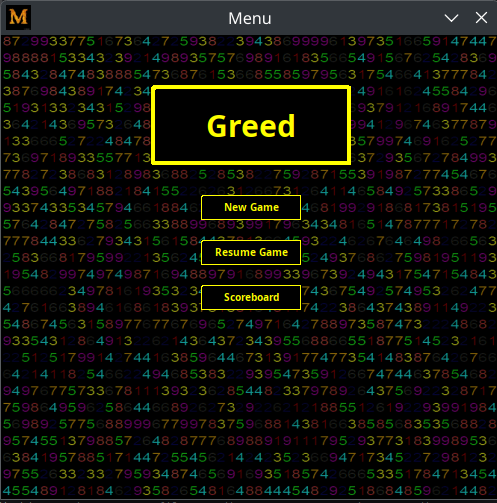
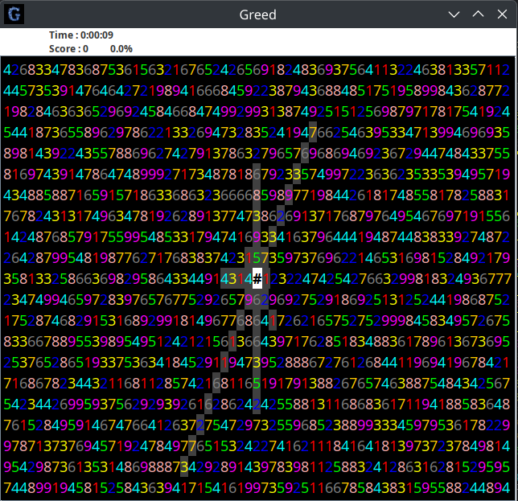
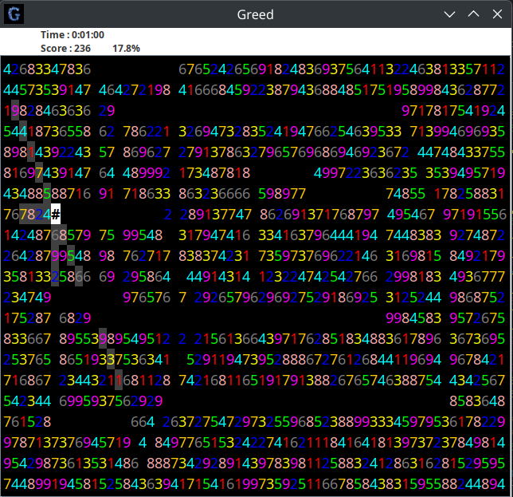
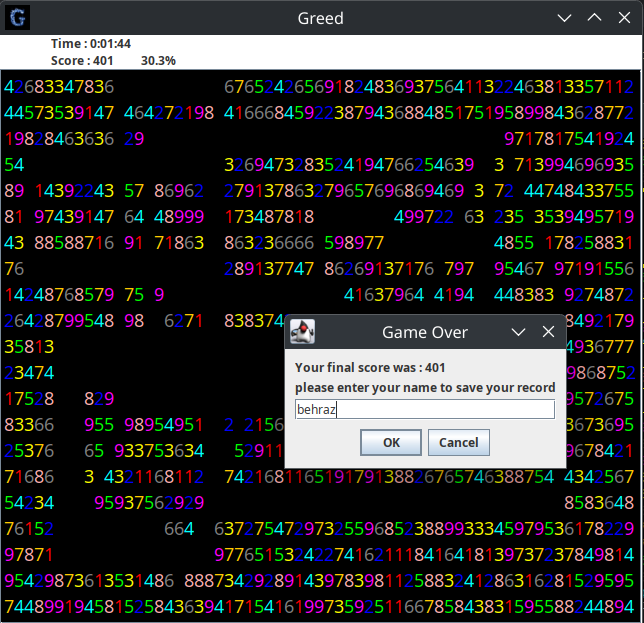
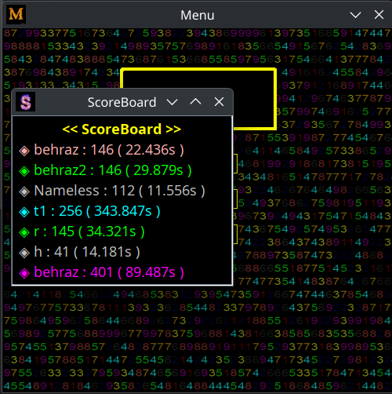

# Greed-Game-Advanced-Programming-Project-1

This project is an implementation of **console-based version of the "Greed" game**, where the player collects scores by moving across a grid of random numbers. 
This was the 1st project of Advanced Programming course

## 🧩 Game Description

* The game board is a grid of size `n × m`, where:

  * `n ≥ 19` (default height)
  * `m = 3n` (always 3 times the height)
* Each cell contains a **random integer between 1 and 9**.
* The player's **initial position** is at the **center of the board**, marked by `@`.
* The player can move in four directions: **up, down, left, right**.

## 🎮 Gameplay Mechanics

1. **Movement**

   * On each move, the player chooses one of the four directions.
   * The number in the cell next to the player in that direction indicates **how many steps** they will move (and how many cells they'll "consume").
   * All passed-through cells are removed (as if "eaten").
   * The player earns points equal to the values of consumed cells.

2. **Score**

   * The **current score is always displayed**.
   * The game continues until the player is **unable to make a valid move** in any direction.

3. **Game End**

   * When no valid moves remain, the game ends and the final score is displayed.

## ✅ Bonus Features (Extra Credit)

*  Display **elapsed playtime** in minutes and seconds
*  Ability to **save and load** game state
*  High score tracking and display in the main menu
*  GUI implementation (if available)
*  8 directions instead of 4

# Pictures

